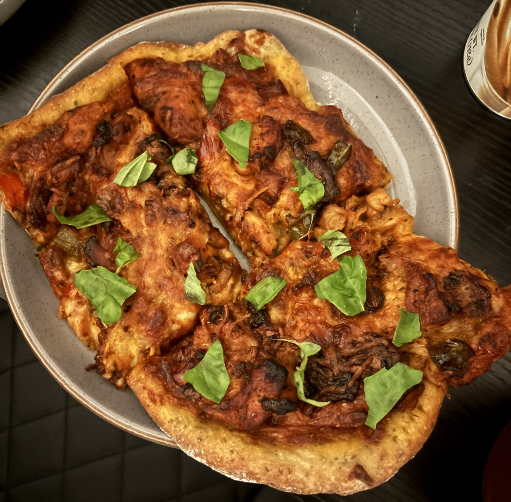
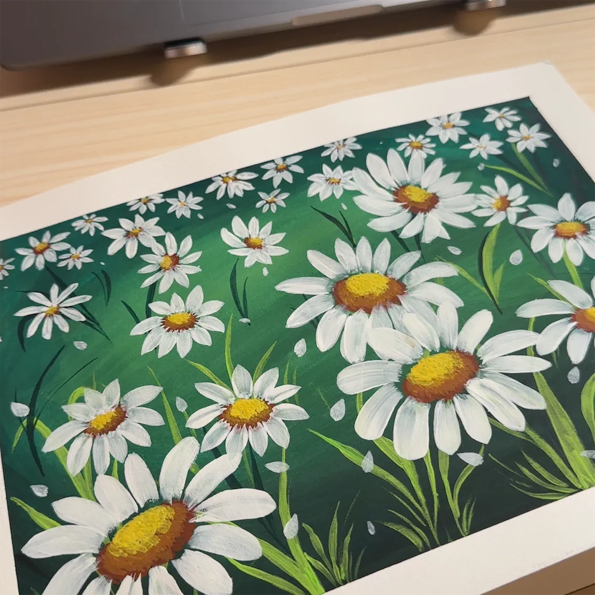
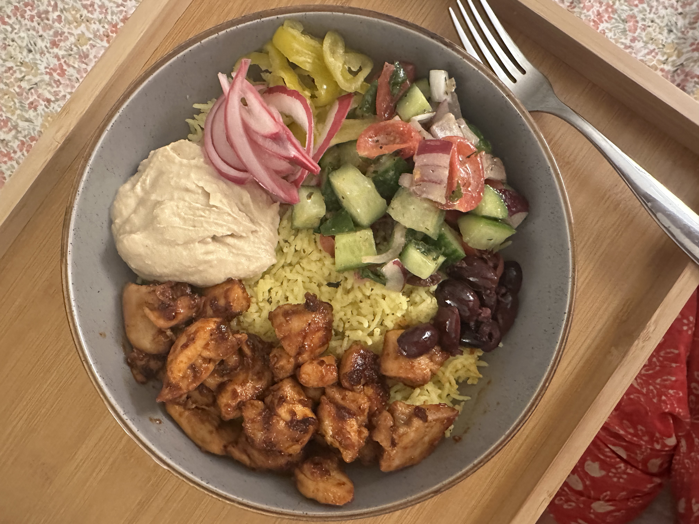
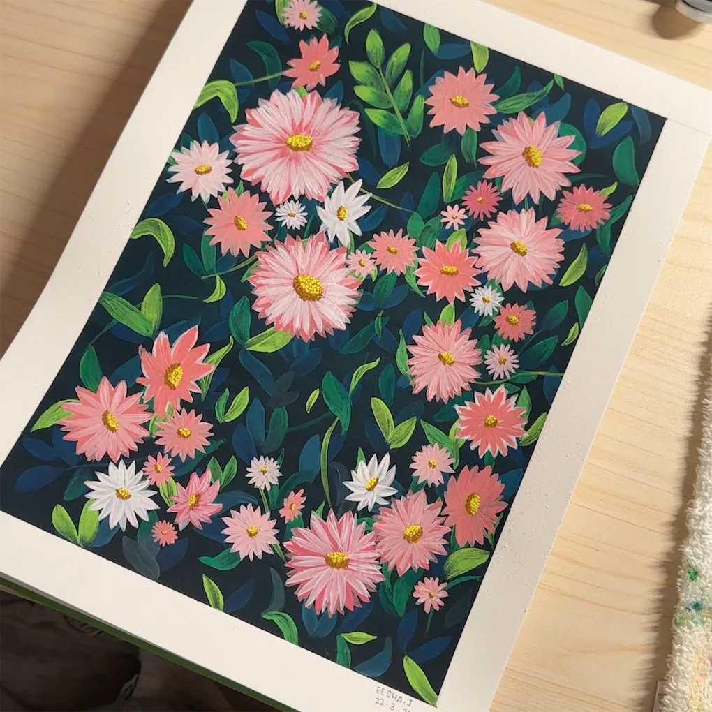

```{=html}
<nav class="nav">
  <div class="nav-inner">
    <a href="index.html" class="brand">EJ.</a>
    <ul class="nav-links">
      <li><a href="about.html">About</a></li>
      <li><a href="experience.html">Experience</a></li>
      <li><a href="projects.html">Projects</a></li>
      <li><a href="hobbies.html" class="active">Hobbies</a></li>
      <li><a href="insights.html">Insights</a></li>
    </ul>
    <a href="contact.html" class="btn-dark">Get in touch</a>
  </div>
</nav>

<main>
<div class="page page-lg reveal">
  <div class="eyebrow page-eyebrow">Hobbies</div>
  <h1 class="page-title">Curiosities that<br>show up in my work.</h1>
  <p class="page-intro">
    These aren't unrelated to the analytical work — they're where I practice noticing
    patterns without a spreadsheet in front of me.
  </p>

  <div class="hobby-grid">
    <div class="hobby-card">
      <div class="hobby-title">Cooking &amp; baking</div>
      <div class="hobby-desc">
        I’ve been cooking and baking since sixth grade, and I’m still always trying new restaurants and dishes around San Diego. Cooking has taught me that small details—timing, consistency, and careful adjustments—can change the entire result. I bring that same attention to my data work, whether I’m validating an output, cleaning a dataset, or finding a better solution when the original request is not possible. Some of my favorite spots are Seneca, Callie, Taco Stand, Din Tai Fung, and Ramen Nagi.
      </div>
    </div>
    <div class="hobby-card">
      <div class="hobby-title">Reading</div>
      <div class="hobby-desc">
        I am drawn to fiction and mysteries because I enjoy following scattered clues until they form a clear story. That same instinct shows up in my analytical work: I like taking information that feels disconnected or complicated and structuring it into something understandable, useful, and easy for others to follow.
      </div>
    </div>
    <div class="hobby-card">
      <div class="hobby-title">Art &amp; sketching</div>
      <div class="hobby-desc">
        My background in studio art taught me to look at something from different angles and imagine how it could work better. I often carry that mindset into my work by quietly redesigning inefficient processes, improving how information is organized, or creating a more intuitive way for someone to complete a task.
      </div>
    </div>
    <div class="hobby-card">
      <div class="hobby-title">Gaming</div>
      <div class="hobby-desc">
        Games have taught me to stay patient with difficult problems, test different approaches, and keep going until I find a way forward. I care about completing the full experience—not just getting to the end, but making sure everything works as expected. That persistence shows up in how I troubleshoot, quality-check, and deliver analytical work.
      </div>
    </div>
  </div>

  <div class="photo-grid">
    
    
    
    
    
    
  </div>
</div>
</main>

<footer class="site-footer">
  <div class="footer-inner">
    <span>Based in San Diego, CA · UCSD MS Business Analytics</span>
    <div class="footer-links">
      <a href="https://linkedin.com/in/eesha-jagdhane" target="_blank" rel="noopener">LinkedIn</a>
      <a href="https://github.com/eeshajagdhane?tab=repositories" target="_blank" rel="noopener">GitHub</a>
      <a href="mailto:ejagdhane99@gmail.com">Email</a>
      <a href="resume.pdf" target="_blank" rel="noopener">Resume</a>
    </div>
    <span>© 2026 Eesha Jagdhane</span>
  </div>
</footer>

<script>
  const io = new IntersectionObserver((entries) => {
    entries.forEach(e => { if (e.isIntersecting) e.target.classList.add('visible'); });
  }, { threshold: 0.08 });
  document.querySelectorAll('.reveal').forEach(el => io.observe(el));
</script>
```
